<div align="center">

# SpecScribe

**Your API's documentation, written by your code.**

Interactive docs, live REST · WebSocket · GraphQL consoles, a mock server and typed SDKs —<br />
generated from the source of your **NestJS**, **Express**, **Fastify** or **Hono** app. No decorators. No setup.

[](https://www.npmjs.com/package/specscribe)
[](https://github.com/Eng-MMustafa/specscribe/actions/workflows/ci.yml)
[](#compatibility)
[](#compatibility)
[](package.json)
[](LICENSE)

```bash
npx specscribe
```

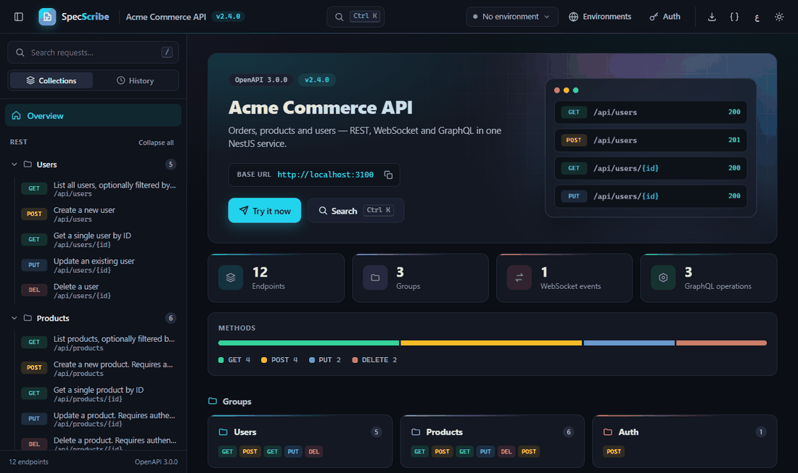

</div>

---

## Why SpecScribe

Most API docs are a second codebase: decorators on every route, a YAML file nobody updates, a Postman collection that drifted months ago. SpecScribe reads the code you already have — controllers, routes, DTOs, validation rules, thrown exceptions, gateways, resolvers — and keeps the docs exactly as true as the code.

- **Nothing to write.** Request bodies, responses, status codes, auth and examples are inferred by static analysis.
- **Nothing to configure.** One command, or one line in a NestJS module. Prefix, host, port and source folder are detected.
- **Nothing to install at runtime.** Zero dependencies; the docs UI is a single inline bundle that works offline.
- **Not just docs.** A Postman-grade workspace, a mock server, contract tests, breaking-change checks and SDKs — from the same scan.

## Quick start

**Any project — no install, no code:**

```bash
cd your-api
npx specscribe
```

It detects the framework, the source folder and your backend's port, starts the docs and opens your browser. "Try it" calls are proxied, so CORS is never in the way.

**Inside a NestJS app — docs on the app's own port:**

```bash
npm install specscribe
npx specscribe init        # adds the single line below to app.module.ts
```

```ts
@Module({
  imports: [SpecScribeModule.forRoot()],   // no options needed
})
export class AppModule {}
```

Start your app as usual; the banner prints the docs link. The global prefix (`app.setGlobalPrefix('api')`), host and port are read from the running app, so every link, "Try it" call and mock response is correct on any port. Docs and mock are **off in production** unless you opt in.

---

## A workspace, not a page

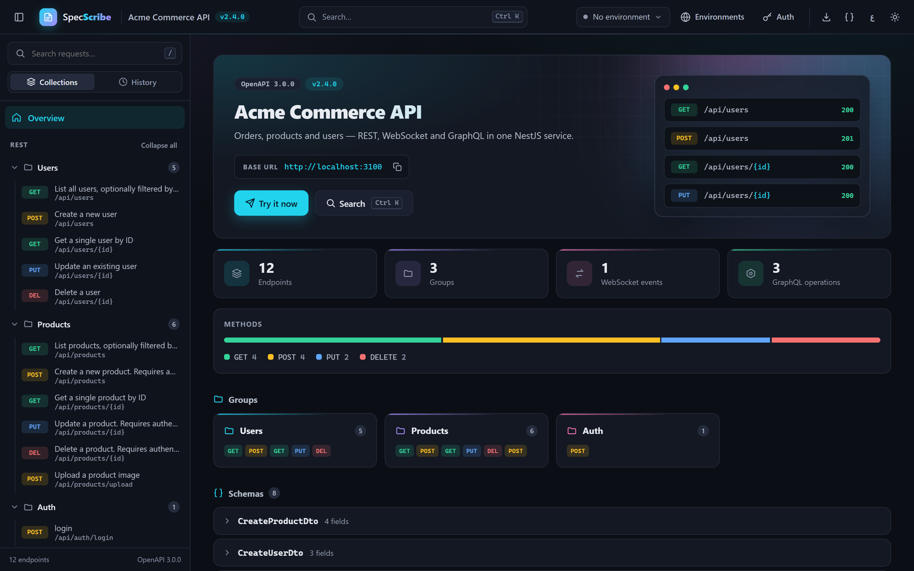

<table>
<tr>
<td width="50%">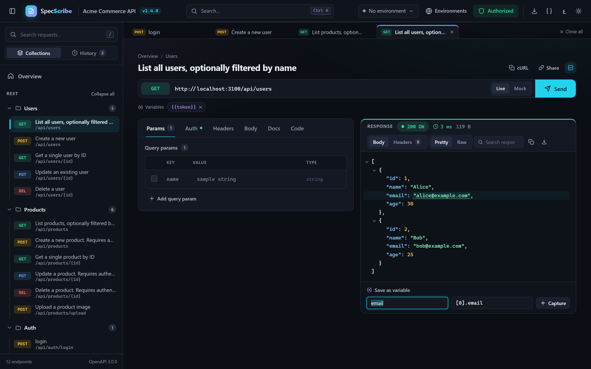</td>
<td width="50%">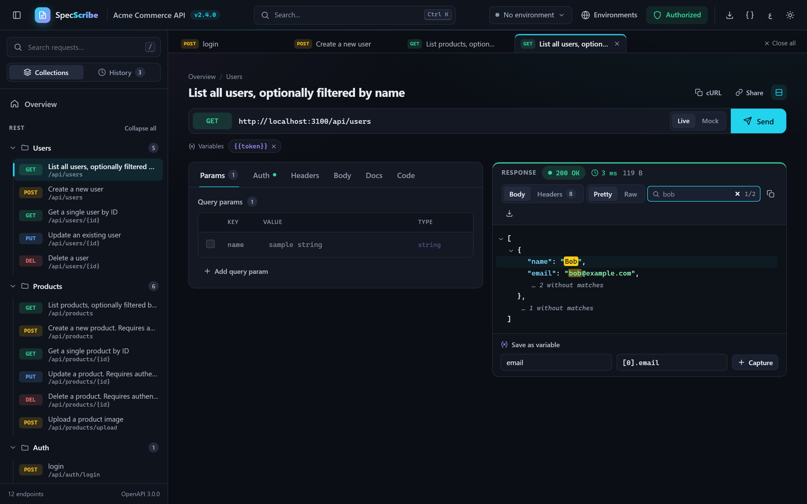</td>
</tr>
<tr>
<td><b>Request tabs, side by side.</b> Keep many requests open, each with its own body, params and response. Bodies come pre-filled from your DTOs with realistic values.</td>
<td><b>Responses you can work with.</b> Collapsible JSON, search with match navigation, and click any value to save it as a <code>{{variable}}</code> for the next request.</td>
</tr>
<tr>
<td>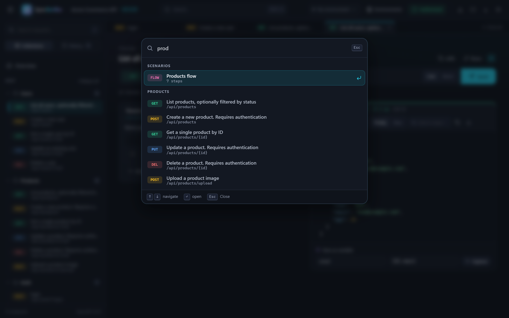</td>
<td>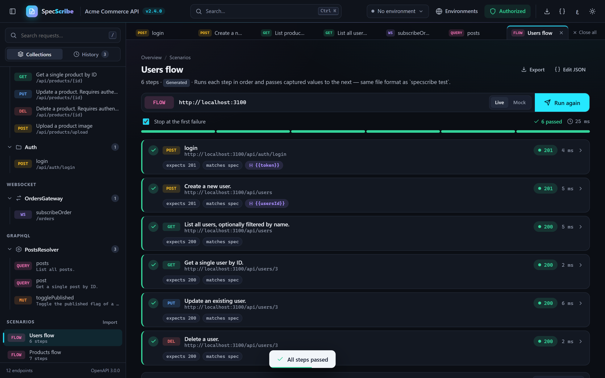</td>
</tr>
<tr>
<td><b>Everything is one keystroke away.</b> <kbd>Ctrl</kbd>/<kbd>⌘</kbd> <kbd>K</kbd> jumps to any endpoint, event, operation, scenario or action.</td>
<td><b>Flows that test themselves.</b> Generated login → create → read → update → delete scenarios run in the browser with captured variables and spec checks — and run in CI with <code>specscribe test</code>.</td>
</tr>
</table>

**Also in the box:** automatic bearer-token capture after login · environments with `{{variables}}`, import/export and Postman environment import · JSON, form-data, file-upload and URL-encoded bodies · per-request or global auth · cURL / fetch / axios snippets · share links · history · Cancel and request timeouts · a Live/Mock switch with a clearly labelled fallback when your API is down · Postman collection export.

### Realtime and GraphQL, side by side with REST

<table>
<tr>
<td width="50%">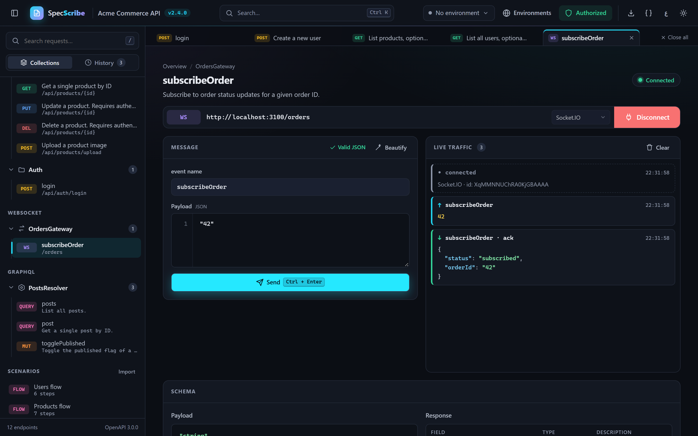</td>
<td width="50%">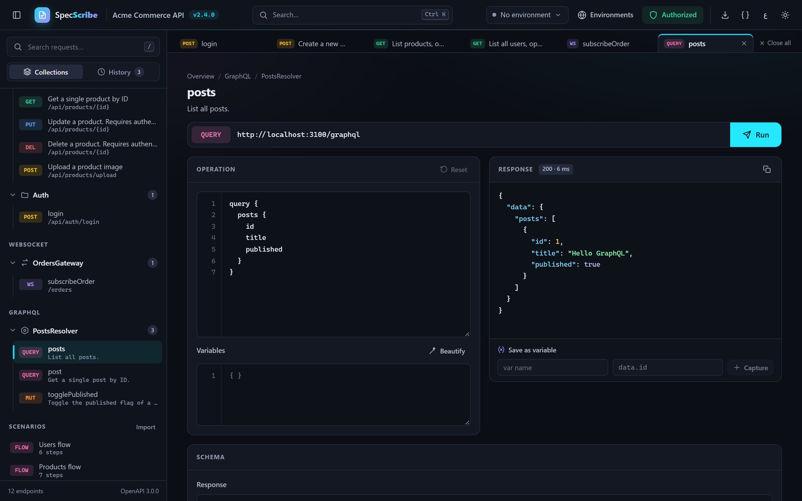</td>
</tr>
<tr>
<td><b>WebSocket console.</b> Gateways and events with payload, acknowledgement and emitted-event shapes. Socket.IO or plain WebSocket is detected from your code — and auto-detected again at connect time.</td>
<td><b>GraphQL console.</b> Queries, mutations and subscriptions (over <code>graphql-ws</code>), pre-filled from your schema with realistic variables.</td>
</tr>
</table>

### Made for every team

<table>
<tr>
<td width="62%">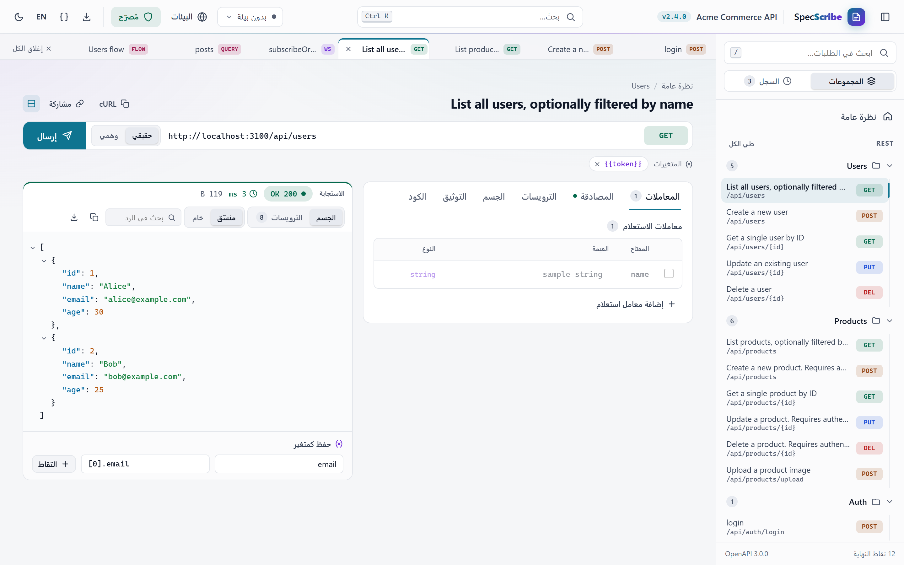</td>
<td width="38%" align="center">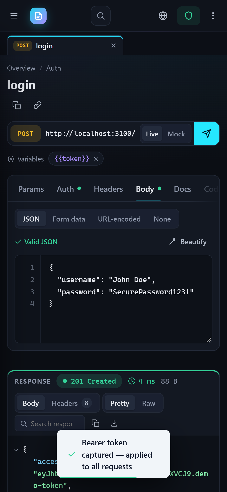</td>
</tr>
<tr>
<td>Dark and light themes, English and Arabic with full right-to-left layout, your brand colour as the accent.</td>
<td>Responsive down to a phone, fully keyboard-operable, and audited with axe-core in both themes.</td>
</tr>
</table>

Fast on big APIs too: 3,000 endpoints render in under 0.3 s.

---

## How it works

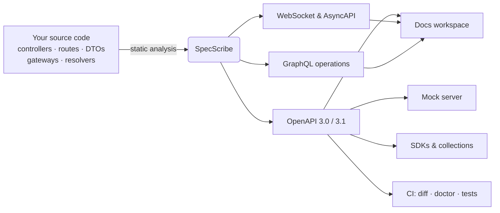

The scanner reads your TypeScript AST (NestJS) or route files (Express, Fastify, Hono) — it never executes your app to document it. The running app only contributes what static analysis cannot see: the global prefix and the address it listens on.

### What it understands

| | NestJS | Express · Fastify · Hono |
|---|---|---|
| **Routes** | `@Controller` + verb decorators, versioning, global prefix | `app.get/post/…`, routers, `app.use()` mounts, `route()` chains, Fastify plugins |
| **Request bodies** | DTO classes, `class-validator` rules, `nestjs-zod`, inheritance, generics | Zod, Joi, Yup, express-validator, TypeScript types, `req.body` destructuring |
| **Responses** | Return types, `@HttpCode`, `throw new NotFoundException(…)` | `res.status(…).json(…)` literals, values followed back to your data |
| **Uploads** | `FileInterceptor` / `FilesInterceptor` fields | multer `single` / `array` / `fields` field names |
| **Auth** | Guards → bearer / API key | auth middleware → bearer |
| **Names** | JSDoc, method names | JSDoc, handler names, REST-style fallbacks, short `operationId`s |
| **Realtime** | `@WebSocketGateway`, `@SubscribeMessage`, `WsAdapter` | Socket.IO events, `@fastify/websocket`, Hono `upgradeWebSocket` |
| **GraphQL** | `@Resolver`, `@Query`, `@Mutation`, `@Subscription` | SDL from Apollo, graphql-yoga, Mercurius, `@hono/graphql-server` |
| **Hints** | `@nestjs/swagger` decorators when present — never required | — |

---

## Beyond the docs

```bash
# A spec-driven mock server for every documented route (on by default in development)
curl http://localhost:3000/specscribe-mock/users/1

# SDKs and collections from the same scan
npx specscribe generate --format client -o api-client.ts       # typed TypeScript client
npx specscribe generate --format react-query -o api-hooks.ts   # or rtk-query
npx specscribe generate --format python-client -o client.py    # or go-client, dart-client
npx specscribe generate --format postman -o collection.json    # or insomnia, bruno
npx specscribe generate --format asyncapi -o asyncapi.json     # WebSocket gateways
npx specscribe generate -o openapi.json --openApiVersion 3.1.0
# (Express, Fastify, Hono: OpenAPI and the React Query / RTK Query / Python / Go / Dart clients;
#  Postman, Insomnia and Bruno import the OpenAPI file directly.)

# Contract testing
npx specscribe test src --generate -o scenarios/   # write scenarios from the API
npx specscribe test scenarios/ --spec src          # run them against a live server

# Keep the API honest in pull requests
npx specscribe diff main-src/ src/ --fail-on-breaking
npx specscribe doctor --min-score 80
npx specscribe changelog old-src/ src/

# A static docs site for GitHub Pages or S3
npx specscribe export -o docs-site
```

### GitHub Action

```yaml
# .github/workflows/api.yml
on: pull_request
jobs:
  api:
    runs-on: ubuntu-latest
    steps:
      - uses: actions/checkout@v4
        with: { fetch-depth: 0 }
      - uses: Eng-MMustafa/specscribe@v1
        with:
          source: src
          fail-on-breaking: true
          min-score: 70
```

Every pull request gets a documentation health score and a breaking-change report against its base branch.

---

## Command line

| Command | What it does |
|---|---|
| `specscribe` | Detect the project, serve its docs, open the browser |
| `specscribe init` | Add `SpecScribeModule.forRoot()` to your NestJS `app.module.ts` |
| `specscribe serve [src]` | Standalone docs server (`--port`, `--baseUrl`, `--no-mock`, `--no-proxy`, `--record <dir>`, `--auth-token`) |
| `specscribe export [src]` | Self-contained static docs site |
| `specscribe generate [src]` | OpenAPI, AsyncAPI, collections and SDKs (`--format`), any framework |
| `specscribe diff <base> <head>` | Classify API changes; `--fail-on-breaking` for CI |
| `specscribe doctor [src]` | 0–100 documentation health score with fixes |
| `specscribe changelog <base> <head>` | Consumer-facing Markdown changelog |
| `specscribe test <scenarios>` | Run JSON scenarios against a live server |

Run `npx specscribe --help` for every flag.

## Configuration

`forRoot()` works with no options. Everything below is optional:

```ts
SpecScribeModule.forRoot({
  path: '/docs',                 // where the docs live
  apiTitle: 'Acme Commerce API', // defaults to package.json name / version / description
  theme: 'futuristic',           // or 'classic' (light)
  primaryColor: '#0ea5e9',
  language: 'en',                // or 'ar' (right-to-left)
  enableDocs: true,              // default: on in development, off in production
  enableMock: true,              // same default as enableDocs
  requireAuthToken: process.env.DOCS_TOKEN, // protect docs with a bearer token
  enableDriftDetection: false,   // warn when real responses differ from the docs
  baseUrl: 'https://api.example.com',       // only to override the detected address
  globalPrefix: 'api',           // only to override the detected prefix
  openApiVersion: '3.1.0',
});
```

## Compatibility

| | Supported |
|---|---|
| **Node.js** | 18.10+, 20, 22, 24 |
| **NestJS** | 10, 11, 12 — on Express (4 · 5) or Fastify (4 · 5) |
| **Without NestJS** | Express, Fastify, Hono — JavaScript or TypeScript |
| **TypeScript** | 5.0 – 6.x |

Every combination above is booted for real in CI. NestJS 11 and 12 themselves need Node 20+ (12 loads through Node's `require(esm)`, 20.19+).

<details>
<summary><b>TypeScript 7?</b></summary>

TypeScript 7 (the native compiler) installs fine and never breaks your app, but it has no stable JavaScript API yet, so NestJS/TypeScript sources can't be scanned with it — the docs page says so instead of listing routes. Express, Fastify and Hono are unaffected. To scan a NestJS project today without touching your own `tsc`:

```bash
npx -p typescript@6 -p specscribe specscribe serve
```
</details>

## Security

- Docs and mock are **disabled by default** when `NODE_ENV=production` or on common PaaS platforms; opt in explicitly.
- Credentials are only sent to the API's own origin, or to an environment you mark as trusted. Imported environment files never send credentials until you enable it.
- The standalone proxy forwards only to `localhost` unless you allow more hosts (`--proxy-allow-hosts`).
- Docs pages ship `X-Content-Type-Options: nosniff` and `X-Frame-Options: DENY`; endpoints can require a bearer token.

## Contributing

Issues and pull requests are welcome.

```bash
npm ci
npm test                         # unit tests
npm run test:e2e                 # real NestJS apps on Express and Fastify
npm run build && npm run test:ui # the docs UI in a real browser, incl. an accessibility audit
```

## License

[MIT](LICENSE) © [Mohamed Mustafa](https://github.com/Eng-MMustafa)
